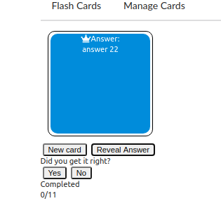
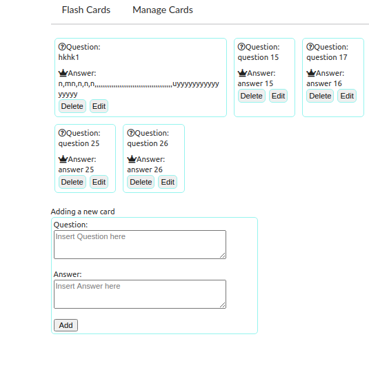

<h1>FlashCards</h1>
<ul>
<li>To play click on the following link:https://elegant-leavitt-4f9569.netlify.app/</li>
<li>Instructions:</li>
<li>Menu header include flash cards and manage cards header.</li>
<li> The default set on flash Cards header.</li>
<li> A card is displayed with a question , click on the button reveal - reveal the answer.</li>
<li>Click on yes button will add 1 to the completed progress bar and remove this card from dack.</li>
<li>Click on no button will not remove the card.</li>
<li>Click on a new card will display a new card with a question.</li>
<li>The first time the cards are shuffled when received from mock API(https://www.mockapi.io/)</li>
<li>When the user has completed all cards an overlay screen displayed that he is the winner.</li>
<li>After click on the reshuffle button, the cards are shuffled and the user begins a new game.</li>

<li>Click on managed cards navigate to manage page.</li>
<li>The user can add new card via the form</li>
<li>The user can edit by clicking on edit, the info of this card will be available in same form of adding a new card</li>
<li>The user can edit the card and by clicking on save button the new info will be saved</li>
<li>Click on button delete will remove the card from the list and mockapi</li>
</ul>

  

